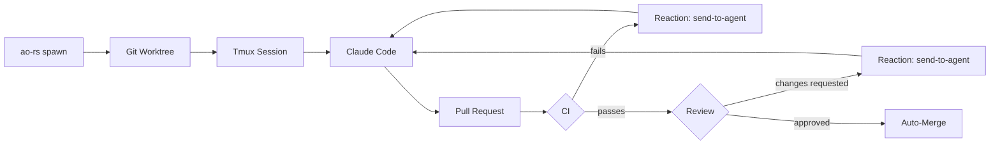
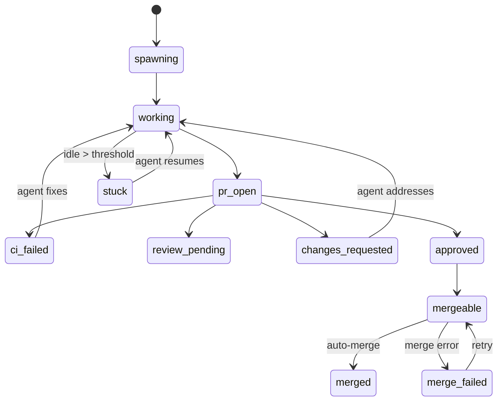

<h1 align="center">ao-rs</h1>

<p align="center">
  <strong>Rust port of <a href="https://github.com/ComposioHQ/agent-orchestrator">Agent Orchestrator</a></strong><br>
  Spawn parallel AI coding agents, each in its own git worktree.<br>
  Agents autonomously fix CI failures, address review comments, and merge PRs.
</p>

<div align="center">

[](LICENSE)
[](https://www.rust-lang.org)
[]()
[]()

</div>

---

This is a **learning project** — the goal is to deeply understand the state machine, reaction engine, and plugin system by rewriting them idiomatically in Rust. Feature parity with the TS original is explicitly **not** a goal.

**What's ported:** core lifecycle, reaction engine, SCM integration, notification routing, 6 of 7 plugin slots

**What's not:** web dashboard, plugin marketplace, multi-agent/runtime support, observability, desktop/Slack/email notifiers

## How It Works

1. **`ao-rs spawn`** creates a git worktree, starts a tmux session, launches Claude Code, and sends the task prompt
2. **`ao-rs watch`** polls every 5s — probes runtime liveness, detects activity, polls GitHub for PR/CI/review state, dispatches reactions
3. **Reactions close the loop** — CI fails → agent gets logs and retries; reviewer requests changes → agent addresses them; approved + green → auto-merge fires
4. **You review and merge** — you only get pulled in when human judgment is needed



## Quick Start

> **Prerequisites:** [Rust 1.80+](https://rustup.rs), [Git 2.25+](https://git-scm.com), [tmux](https://github.com/tmux/tmux/wiki/Installing), [`gh` CLI](https://cli.github.com) (authenticated), [`claude`](https://docs.anthropic.com/en/docs/claude-code) (optional)

```bash
# Build
cargo build --release

# Spawn an agent session
ao-rs spawn --task "fix the failing tests" --repo ~/my-project --project myapp

# Watch the lifecycle loop (in another terminal)
ao-rs watch

# Check status
ao-rs status --pr
```

<details>
<summary><strong>More commands</strong></summary>

```bash
# Send a follow-up message to a running agent
ao-rs send 3a4b5c6d "also update the README"

# View PR details for a session
ao-rs pr 3a4b5c6d

# Restore a crashed session
ao-rs session restore 3a4b5c6d
```

</details>

## Configuration

Optional config at `~/.ao-rs/config.yaml`. No config file = sensible defaults (no reactions, stdout notifications).

```yaml
reactions:
  ci-failed:
    auto: true
    action: send-to-agent
    message: "CI failed. Read the logs, fix the issue, and push again."
    retries: 3
    escalate_after: 3          # escalate to notify after 3 failed attempts

  changes-requested:
    auto: true
    action: send-to-agent
    retries: 2
    escalate_after: 30m        # or escalate after a duration

  approved-and-green:
    auto: true                 # set false for manual merge
    action: auto-merge
    priority: info

  agent-stuck:
    auto: true
    action: notify
    threshold: 10m             # idle time before flagging
    priority: warning

notification_routing:
  urgent: [stdout, ntfy]
  action: [stdout, ntfy]
  warning: [stdout]
  info: [stdout]
```

CI fails → agent gets the logs and fixes it. Reviewer requests changes → agent addresses them. PR approved with green CI → auto-merge. Agent goes idle for 10 minutes → you get notified.

<details>
<summary><strong>Environment variables</strong></summary>

| Variable | Purpose |
|----------|---------|
| `AO_NTFY_TOPIC` | Enable the [ntfy.sh](https://ntfy.sh) notifier with this topic |
| `AO_NTFY_URL` | Custom ntfy server URL (default: `https://ntfy.sh`) |
| `RUST_LOG` | Log level filter (default: `warn,ao_core=info`) |

</details>

## Plugin Architecture

Six plugin slots. One crate per plugin. Compile-time trait objects — no dynamic discovery.

| Slot | Trait | Implementation | Notes |
|------|-------|----------------|-------|
| Runtime | `Runtime` | tmux | Shell-out to `tmux` |
| Agent | `Agent` | Claude Code | Shell-out to `claude` |
| Workspace | `Workspace` | git worktree | Shell-out to `git` |
| SCM | `Scm` | GitHub | Shell-out to `gh` CLI |
| Tracker | `Tracker` | GitHub Issues | Shell-out to `gh` CLI |
| Notifier | `Notifier` | stdout, ntfy.sh | Always-on + opt-in HTTP |

All interfaces defined in [`ao-core/src/traits.rs`](crates/ao-core/src/traits.rs) and [`ao-core/src/notifier.rs`](crates/ao-core/src/notifier.rs). A plugin implements one trait and wires into `ao-cli` behind `Arc<dyn Trait>`.

<details>
<summary><strong>Comparison with TS Agent Orchestrator</strong></summary>

The TS original has 23 plugin packages across 7 slots with multiple alternatives per slot:

| Slot | TS alternatives | ao-rs |
|------|----------------|-------|
| Runtime | tmux, process, docker, k8s, ssh, e2b | tmux only |
| Agent | claude-code, codex, aider, cursor, opencode | claude-code only |
| Workspace | worktree, clone | worktree only |
| Tracker | github, linear, gitlab | github only |
| SCM | github, gitlab | github only |
| Notifier | desktop, slack, discord, webhook, composio, openclaw | stdout, ntfy |
| Terminal | iterm2, web | not ported |

Also not ported: web dashboard, plugin marketplace, GraphQL PR batching, observability/metrics, hot-reload, feedback tools, prompt builder.

</details>

## State Machine

18 session statuses across a full PR lifecycle:



See [docs/state-machine.md](docs/state-machine.md) for the full transition table, PR-driven logic, stuck detection, and the `merge_failed` parking loop.

## Crate Structure

```
ao-rs/
├── crates/
│   ├── ao-core/                          # Domain types, traits, state machine, reaction engine
│   ├── ao-cli/                           # `ao-rs` binary (clap)
│   ├── ao-plugin-workspace-worktree/     # git worktree via shell-out
│   ├── ao-plugin-runtime-tmux/           # tmux session management
│   ├── ao-plugin-agent-claude-code/      # Claude Code adapter
│   ├── ao-plugin-scm-github/            # GitHub SCM via gh CLI
│   ├── ao-plugin-tracker-github/        # GitHub Issues tracker via gh CLI
│   ├── ao-plugin-notifier-stdout/       # Terminal notification (always on)
│   └── ao-plugin-notifier-ntfy/         # ntfy.sh HTTP POST notifications
├── docs/                                 # Architecture, state machine, reactions, CLI reference
└── Cargo.toml                            # Workspace root
```

## Design Principles

1. **Shell-out over libraries** — `git`, `tmux`, `gh` are subprocesses, not crates
2. **Disk is the source of truth** — no in-memory cache; every read walks `~/.ao-rs/sessions/`
3. **Trait objects at plugin boundaries** — keeps the CLI clean, lets tests use mocks
4. **One crate per plugin** — clear dependency story
5. **Comments explain *why*** — and reference the TS file the logic mirrors
6. **Never port file-by-file** — read TS for intent, write idiomatic Rust

## Development

```bash
cargo build --workspace                    # Build all crates
cargo test --workspace                     # Run 268 tests
cargo clippy --workspace -- -D warnings    # Lint
cargo fmt --all -- --check                 # Format check
```

## Documentation

| Document | Content |
|----------|---------|
| [architecture.md](docs/architecture.md) | Crate structure, disk layout, design principles, TS divergences |
| [state-machine.md](docs/state-machine.md) | 18-state lifecycle, transitions, PR-driven logic, stuck detection |
| [reactions.md](docs/reactions.md) | Reaction engine, config shape, notification routing, escalation |
| [cli-reference.md](docs/cli-reference.md) | All CLI subcommands with flags and examples |
| [plugin-spec.md](docs/plugin-spec.md) | Plugin trait contracts, slot list, how to add a plugin |

## License

MIT
