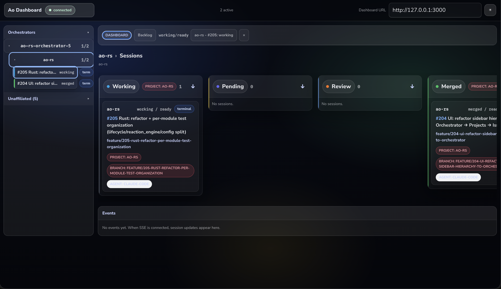
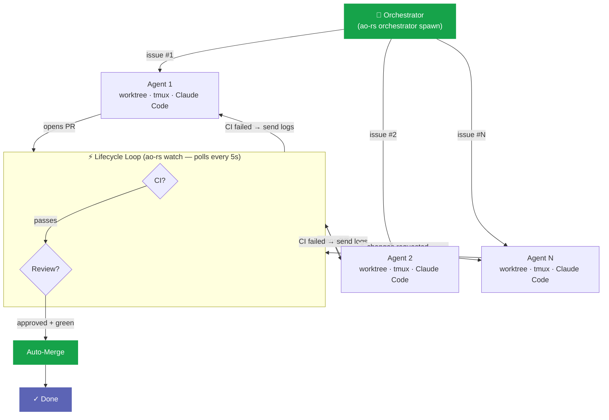
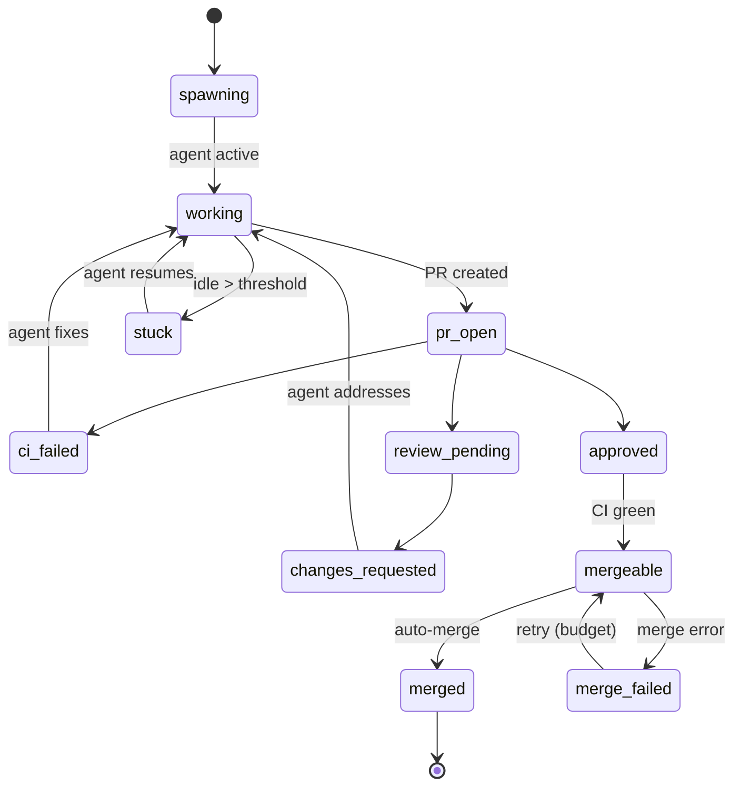

<div align="center">

# ao-rs

**Spawn parallel AI coding agents. Each gets its own worktree.**  
**They fix CI, address reviews, and merge PRs — autonomously.**

A Rust port of [Agent Orchestrator](https://github.com/ComposioHQ/agent-orchestrator) — a tool that lets AI coding agents (Claude Code, Codex, Aider…) work autonomously on GitHub issues inside isolated git worktrees, reacting to CI failures and code reviews without human intervention. ao-rs is faster, leaner, and adds features the original doesn't have.

[](https://github.com/duonghb53/ao-rs/actions/workflows/ci.yml)
[](LICENSE)
[](https://www.rust-lang.org)

</div>

---

## Dashboard



*Left sidebar groups sessions under their Orchestrator → Project. Lanes (Working / Pending / Review / Merged) update live via SSE.*

---

## Why ao-rs?

|  | ao-rs | ao-ts |
|--|--|--|
| **Startup** | **28 ms** | 770 ms — 27× slower |
| **Memory** | **9 MB** | 87 MB — 9.5× more |
| **Install** | **7.1 MB** single binary | 180+ MB node_modules |

→ Full benchmark results, feature diff, and plugin comparison: **[BENCHMARKING.md](BENCHMARKING.md)**

### Features ao-rs has that ao-ts doesn't

| Feature | Description |
|---------|-------------|
| **Monthly cost ledger** | `~/.ao-rs/cost-ledger/YYYY-MM.yaml` — permanent per-session cost backup that survives session deletion |
| **`ao-rs status --cost`** | Cost column (tokens + USD) in the status table — ao-ts has no equivalent CLI flag |
| **Embedded REST + SSE API** | axum server built into the single binary — ao-ts requires a separate Next.js server process |
| **Agent rules injection** | Structured 6-step dev lifecycle (UNDERSTAND/PLAN/IMPLEMENT/VERIFY/REVIEW/DELIVER) injected as agent system prompt |
| **MergeFailed parking loop** | `Mergeable ↔ MergeFailed` retry with configurable budget — ao-ts has no merge-retry state |
| **Single binary** | `cargo install` and go — no Node.js, no npm, no runtime dependencies |

---

## How It Works



1. **`ao-rs orchestrator spawn`** — starts an AI orchestrator that reads your issue backlog, spawns worker agents in parallel (one per issue), and monitors their progress
2. **Each worker** gets its own isolated git worktree, tmux session, and agent process — they can't interfere with each other
3. **`ao-rs watch`** — polls every 5s across all sessions: runtime liveness, agent activity, GitHub PR/CI/review state
4. **Reactions close the loop** — CI fails? Each agent gets its own logs. Changes requested? That agent addresses them. Approved + green? Auto-merge fires per session.
5. **You get notified** — only when human judgment is needed (stuck agent, exhausted retries, merge conflicts)

---

## Quick Start

> **Prerequisites:** [Rust 1.89+](https://rustup.rs) · [tmux](https://github.com/tmux/tmux/wiki/Installing) · [`gh` CLI](https://cli.github.com) (authenticated) · [`claude`](https://docs.anthropic.com/en/docs/claude-code)

```bash
# Install from crates.io
cargo install ao-rs

# Or build from source
git clone https://github.com/duonghb53/ao-rs
cd ao-rs
cargo install --path crates/ao-cli

# Initialize a project (generates ao-rs.yaml)
cd /path/to/your/project
ao-rs start

# Spawn an agent on a GitHub issue
ao-rs spawn --issue 42

# Or with a free-form task
ao-rs spawn --task "fix the failing tests"

# Watch the lifecycle loop
ao-rs watch

# Open the dashboard
ao-rs dashboard --open

# Check status
ao-rs status --cost --pr
```

For a complete walkthrough see **[docs/user-guide.md](docs/user-guide.md)**.

---

## Configuration

`ao-rs start` generates `ao-rs.yaml` in your project directory. No config file = no reactions, stdout-only notifications.

```yaml
reactions:
  ci-failed:
    action: send-to-agent
    message: "CI failed. Read the logs, fix the issue, and push again."
    retries: 3
    escalate_after: 3             # escalate after 3 failed attempts

  changes-requested:
    action: send-to-agent
    retries: 2
    escalate_after: 30m           # or escalate after a duration

  approved-and-green:
    action: auto-merge
    priority: info

  agent-stuck:
    action: notify
    threshold: 10m
    priority: warning

notification_routing:
  urgent:  [stdout, ntfy, desktop, discord]
  action:  [stdout, ntfy]
  warning: [stdout, desktop]
  info:    [stdout]
```

<details>
<summary><strong>Environment variables</strong></summary>

| Variable | Purpose |
|----------|---------|
| `AO_NTFY_TOPIC` | [ntfy.sh](https://ntfy.sh) topic for push notifications |
| `AO_NTFY_URL` | Custom ntfy server (default: `https://ntfy.sh`) |
| `AO_DISCORD_WEBHOOK_URL` | Discord webhook URL |
| `AO_SLACK_WEBHOOK_URL` | Slack incoming webhook URL |
| `RUST_LOG` | Log level (default: `warn,ao_core=info`) |

</details>

Full config reference: **[docs/config.md](docs/config.md)**

---

## Dashboard API

`ao-rs dashboard` starts an axum server with REST + Server-Sent Events:

| Method | Endpoint | Description |
|--------|----------|-------------|
| `GET` | `/api/sessions` | List all sessions (JSON) |
| `GET` | `/api/sessions/:id` | Get session by id or prefix |
| `POST` | `/api/sessions/:id/message` | Send message to agent |
| `POST` | `/api/sessions/:id/kill` | Kill session runtime |
| `POST` | `/api/sessions/:id/restore` | Restore terminated session |
| `GET` | `/api/orchestrators` | List orchestrator sessions |
| `POST` | `/api/orchestrators` | Spawn a new orchestrator |
| `GET` | `/api/issues` | Aggregate open issues across projects |
| `GET` | `/api/events` | SSE stream of lifecycle events |

```bash
ao-rs dashboard --port 3000 --open
curl http://localhost:3000/api/sessions | jq
curl -N http://localhost:3000/api/events   # SSE stream
```

---

## State Machine



See [docs/state-machine.md](docs/state-machine.md) for the full transition table.

---

## Architecture

```
ao-rs/
├── crates/
│   ├── ao-core/                    # Types, traits, state machine, reaction engine, cost ledger
│   ├── ao-cli/                     # `ao-rs` binary (clap)
│   ├── ao-dashboard/               # REST API + SSE server (axum)
│   ├── ao-desktop/                 # Dashboard web UI (Vite + React)
│   └── plugins/
│       ├── runtime-tmux/           # Tmux session management
│       ├── agent-claude-code/      # Claude Code adapter + JSONL cost parser
│       ├── agent-cursor/           # Cursor IDE adapter
│       ├── agent-aider/            # Aider adapter
│       ├── agent-codex/            # Codex adapter
│       ├── workspace-worktree/     # Git worktree isolation
│       ├── scm-github/             # GitHub PRs via `gh` CLI
│       ├── scm-gitlab/             # GitLab MRs via REST API
│       ├── tracker-github/         # GitHub Issues via `gh` CLI
│       ├── notifier-stdout/        # Terminal output (always on)
│       ├── notifier-ntfy/          # ntfy.sh push notifications
│       ├── notifier-desktop/       # Native OS notifications
│       └── notifier-discord/       # Discord webhook
├── scripts/
│   └── benchmark.sh                # Performance comparison vs ao-ts
└── docs/                           # Architecture, state machine, reactions, CLI ref, plugin spec
```

<details>
<summary><strong>Plugin system — 6 trait slots</strong></summary>

| Slot | Trait | Implementations |
|------|-------|-----------------|
| Runtime | `Runtime` | tmux, process |
| Agent | `Agent` | Claude Code, Cursor, Aider, Codex |
| Workspace | `Workspace` | git worktree |
| SCM | `Scm` | GitHub, GitLab |
| Tracker | `Tracker` | GitHub Issues |
| Notifier | `Notifier` | stdout, ntfy, desktop, discord |

</details>

### Design Principles

1. **Shell-out over libraries** — `git`, `tmux`, `gh` are subprocesses, not Rust crate bindings
2. **Disk is the source of truth** — no in-memory cache; every read walks `~/.ao-rs/sessions/`
3. **Trait objects at plugin boundaries** — keeps the binary clean, lets tests use mocks
4. **One crate per plugin** — clear dependency graph, fast incremental builds
5. **Never port file-by-file** — read TS for intent, write idiomatic Rust

---

## Development

```bash
cargo build --workspace                            # Build all crates
cargo t --workspace                                # Run tests via nextest (fast + isolated)
cargo test --doc --workspace                       # Run doctests
cargo clippy --workspace --tests -- -D warnings    # Lint
cargo fmt --all -- --check                         # Format check

# Run benchmarks against ao-ts
./scripts/benchmark.sh ~/study/agent-orchestrator
```

> **Note on CPU usage:** tests run via [`cargo nextest`](https://nexte.st) (aliased as `cargo t`).
> Cap threads on laptops: `cargo t --workspace --test-threads=2`

## Documentation

| Document | Content |
|----------|---------|
| [user-guide.md](docs/user-guide.md) | Step-by-step walkthrough of all CLI commands and workflows |
| [architecture.md](docs/architecture.md) | Crate structure, disk layout, design principles |
| [state-machine.md](docs/state-machine.md) | 18-state lifecycle, PR transitions, stuck detection |
| [reactions.md](docs/reactions.md) | Reaction engine, notification routing, escalation |
| [cli-reference.md](docs/cli-reference.md) | All CLI subcommands with flags and examples |
| [config.md](docs/config.md) | Full config file reference |
| [plugin-spec.md](docs/plugin-spec.md) | Plugin trait contracts, how to add a plugin |

---

## Roadmap

- [x] Core lifecycle + state machine
- [x] Reaction engine + SCM integration (GitHub + GitLab)
- [x] Notification routing: stdout, ntfy, desktop, discord
- [x] Dashboard REST API + SSE
- [x] Per-session cost tracking + monthly ledger
- [x] Web dashboard UI (React + Vite, Orchestrator → Projects hierarchy)
- [x] Additional agent plugins: Cursor, Aider, Codex
- [x] `ao-rs orchestrator` — meta-agent that spawns and monitors workers
- [x] Publish to crates.io
- [ ] Tauri desktop app wrapper (planned)

---

## License

[MIT](LICENSE) © 2026 Ha Duong
