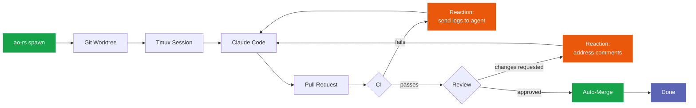
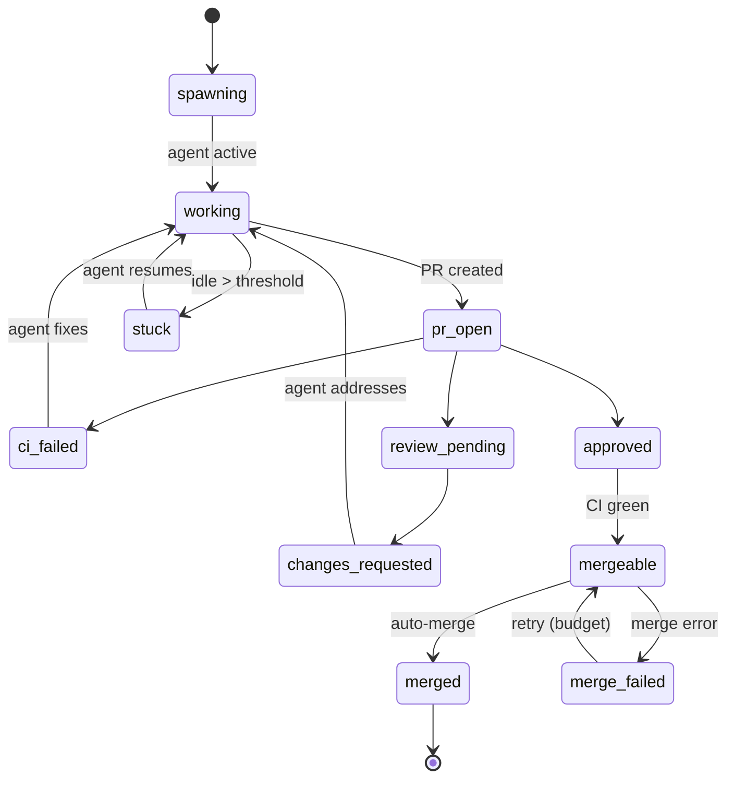

<div align="center">


# ao-rs

**Spawn parallel AI coding agents. Each gets its own worktree.**
**They fix CI, address reviews, and merge PRs — autonomously.**

A Rust port of [Agent Orchestrator](https://github.com/ComposioHQ/agent-orchestrator) — a tool that lets AI coding agents (Claude Code, Codex, Aider…) work autonomously on GitHub issues inside isolated git worktrees, reacting to CI failures and code reviews without human intervention. ao-rs is faster, leaner, and adds features the original doesn't have.

[](LICENSE)
[](https://www.rust-lang.org)
[]()
[]()
[]()

</div>

---

## Why ao-rs?

|  | ao-rs | ao-ts |
|--|--|--|
| **Startup** | **28 ms** | 770 ms — 27× slower |
| **Memory** | **9 MB** | 87 MB — 9.5× more |
| **Install** | **7.1 MB** single binary | 180+ MB node_modules |

→ Full benchmark results, feature diff, and plugin comparison: **[BENCHMARKING.md](BENCHMARKING.md)**

### Features ao-rs has that ao-ts doesn't

| Feature | Description |
|---------|-------------|
| **Per-session cost tracking** | Token counts + USD estimates from Claude Code JSONL logs, persisted per-session and in monthly cost ledger |
| **Monthly cost ledger** | `~/.ao-rs/cost-ledger/YYYY-MM.yaml` — permanent backup that survives session deletion |
| **`ao-rs status --cost`** | See cost per agent session at a glance |
| **Dashboard REST API** | Built-in axum server with `/api/sessions`, `/api/events` SSE — no separate web framework needed |
| **`ao-rs start`** | One command: generate config + install ai-devkit skills |
| **Agent rules injection** | `--append-system-prompt` with structured 6-step dev lifecycle (UNDERSTAND/PLAN/IMPLEMENT/VERIFY/REVIEW/DELIVER) |
| **MergeFailed parking loop** | `Mergeable <-> MergeFailed` retry with budget — handles flaky merge calls gracefully |
| **Duration-based escalation** | `escalate_after: 30m` alongside attempt-count escalation |
| **Notification routing** | Priority-based routing (urgent/action/warning/info) to multiple channels |
| **Single binary** | `cargo install` and go — no Node.js, no npm, no runtime |

---

## How It Works



1. **`ao-rs spawn`** — creates a git worktree, starts a tmux session, launches Claude Code with structured agent rules, sends the task
2. **`ao-rs watch`** — polls every 5s: runtime liveness, agent activity, GitHub PR/CI/review state, dispatches reactions
3. **Reactions close the loop** — CI fails? Agent gets the logs. Changes requested? Agent addresses them. Approved + green? Auto-merge fires.
4. **You get notified** — only when human judgment is needed (stuck agent, exhausted retries, merge conflicts)

---

## Quick Start

> **Prerequisites:** [Rust 1.89+](https://rustup.rs) &bull; [tmux](https://github.com/tmux/tmux/wiki/Installing) &bull; [`gh` CLI](https://cli.github.com) (authenticated) &bull; [`claude`](https://docs.anthropic.com/en/docs/claude-code)

```bash
# Install
cargo install --path crates/ao-cli

# Initialize a project
ao-rs start

# Spawn an agent session
ao-rs spawn --task "fix the failing tests" --repo . --project myapp

# Watch the lifecycle loop
ao-rs watch

# Check status with cost
ao-rs status --cost --pr
```

### Cooler `cargo test --workspace` (avoid high CPU)

If `cargo test --workspace` uses too much CPU on your laptop, cap both Cargo parallelism and test threads:

```bash
cargo test --workspace -j 2 -- --test-threads=1
```

This repo also includes `.cargo/config.toml` with `[build] jobs = 2` so workspace builds are less aggressive by default (you can still override with `-j`).

### All Commands

| Command | Description |
|---------|-------------|
| `ao-rs start` | Generate config + install ai-devkit skills |
| `ao-rs spawn (--task "..." \| --issue 42 \| --local-issue docs/issues/0001-...md)` | Spawn a new agent session |
| `ao-rs batch-spawn 42 43 44` | Spawn one session per GitHub issue (skips duplicates unless `--force`) |
| `ao-rs status [--pr] [--cost]` | List sessions with optional PR/cost columns |
| `ao-rs watch [--interval 5]` | Run lifecycle loop (daemon mode) |
| `ao-rs dashboard [--port 3000] [--open]` | REST API + SSE server |
| `ao-rs send <id> "message"` | Send message to a running agent |
| `ao-rs pr <id>` | Inspect PR/CI/review state |
| `ao-rs review-check [--dry-run]` | Scan session PRs for new review comments and forward to agents |
| `ao-rs doctor` | Check required tools/auth/config health |
| `ao-rs session restore <id>` | Respawn a terminated session |
| `ao-rs session attach <id>` | Attach to a session’s tmux terminal |
| `ao-rs kill <id>` | Kill runtime, remove worktree, archive session |
| `ao-rs cleanup [--dry-run]` | Remove worktrees and archive terminal sessions |
| `ao-rs issue new/list/show ...` | Local markdown issue helper (`docs/issues/`) |

---

## Configuration

`ao-rs start` generates `ao-rs.yaml` in your project directory. You can also create it manually. No config file = no reactions, stdout-only notifications.

```yaml
reactions:
  ci-failed:
    auto: true
    action: send-to-agent
    message: "CI failed. Read the logs, fix the issue, and push again."
    retries: 3
    escalate_after: 3             # escalate after 3 failed attempts

  changes-requested:
    auto: true
    action: send-to-agent
    retries: 2
    escalate_after: 30m           # or escalate after a duration

  approved-and-green:
    auto: true
    action: auto-merge
    priority: info

  agent-stuck:
    auto: true
    action: notify
    threshold: 10m
    priority: warning

notification_routing:
  urgent:  [stdout, ntfy, desktop, discord]
  action:  [stdout, ntfy]
  warning: [stdout, desktop]
  info:    [stdout]
```

<details>
<summary><strong>Environment variables</strong></summary>

| Variable | Purpose |
|----------|---------|
| `AO_NTFY_TOPIC` | [ntfy.sh](https://ntfy.sh) topic for push notifications |
| `AO_NTFY_URL` | Custom ntfy server (default: `https://ntfy.sh`) |
| `AO_DISCORD_WEBHOOK_URL` | Discord webhook URL for notifications |
| `AO_SLACK_WEBHOOK_URL` | Slack incoming webhook URL for notifications |
| `RUST_LOG` | Log level (default: `warn,ao_core=info`) |

</details>

---

## Dashboard API

`ao-rs dashboard` starts an axum server with REST + Server-Sent Events:

| Method | Endpoint | Description |
|--------|----------|-------------|
| `GET` | `/api/sessions` | List all sessions (JSON) |
| `GET` | `/api/sessions/:id` | Get session by id or prefix |
| `POST` | `/api/sessions/:id/message` | Send message to agent |
| `POST` | `/api/sessions/:id/kill` | Kill session runtime |
| `GET` | `/api/events` | SSE stream of lifecycle events |

```bash
# Start the dashboard
ao-rs dashboard --port 3000

# In another terminal
curl http://localhost:3000/api/sessions | jq
curl -N http://localhost:3000/api/events   # SSE stream
```

---

## State Machine

18 session statuses across the full PR lifecycle:



See [docs/state-machine.md](docs/state-machine.md) for the full transition table, including the `MergeFailed` parking loop and stuck detection.

---

## Architecture

```
ao-rs/
├── crates/
│   ├── ao-core/                    # Types, traits, state machine, reaction engine, cost ledger
│   ├── ao-cli/                     # `ao-rs` binary (clap)
│   ├── ao-dashboard/               # REST API + SSE server (axum)
│   └── plugins/
│       ├── runtime-tmux/           # Tmux session management
│       ├── agent-claude-code/      # Claude Code adapter + JSONL cost parser
│       ├── workspace-worktree/     # Git worktree isolation
│       ├── scm-github/             # GitHub PRs via `gh` CLI
│       ├── tracker-github/         # GitHub Issues via `gh` CLI
│       ├── notifier-stdout/        # Terminal output (always on)
│       ├── notifier-ntfy/          # ntfy.sh push notifications
│       ├── notifier-desktop/       # Native OS notifications
│       └── notifier-discord/       # Discord webhook
├── scripts/
│   └── benchmark.sh                # Performance comparison vs ao-ts
└── docs/                           # Architecture, state machine, reactions, CLI ref, plugin spec
```

### Plugin System

6 trait-based plugin slots. One crate per implementation. Compile-time dispatch via `Arc<dyn Trait>`.

| Slot | Trait | Implementations | How |
|------|-------|-----------------|-----|
| Runtime | `Runtime` | tmux | Shell-out to `tmux` |
| Agent | `Agent` | Claude Code | Shell-out to `claude` |
| Workspace | `Workspace` | git worktree | Shell-out to `git` |
| SCM | `Scm` | GitHub | Shell-out to `gh` |
| Tracker | `Tracker` | GitHub Issues | Shell-out to `gh` |
| Notifier | `Notifier` | stdout, ntfy, desktop, discord | Trait objects in registry |

<details>
<summary><strong>Comparison with TS Agent Orchestrator (22 plugins)</strong></summary>

| Slot | ao-ts | ao-rs |
|------|-------|-------|
| Runtime | tmux, process, docker, k8s, ssh, e2b | tmux |
| Agent | claude-code, codex, aider, cursor, opencode | claude-code |
| Workspace | worktree, clone | worktree |
| Tracker | github, linear, gitlab | github |
| SCM | github, gitlab | github |
| Notifier | desktop, slack, discord, webhook, composio, openclaw | stdout, ntfy, desktop, discord |
| Terminal | iterm2, web | *(planned: Tauri)* |

</details>

### Design Principles

1. **Shell-out over libraries** — `git`, `tmux`, `gh` are subprocesses, not Rust crate bindings
2. **Disk is the source of truth** — no in-memory cache; every read walks `~/.ao-rs/sessions/`
3. **Trait objects at plugin boundaries** — keeps the binary clean, lets tests use mocks
4. **One crate per plugin** — clear dependency graph, fast incremental builds
5. **Never port file-by-file** — read TS for intent, write idiomatic Rust

---

## Development

```bash
cargo build --workspace                            # Build all 12 crates
cargo test --workspace                             # Run 310 tests
cargo clippy --workspace --tests -- -D warnings    # Lint
cargo fmt --all -- --check                         # Format check

# Run benchmarks against ao-ts
./scripts/benchmark.sh ~/study/agent-orchestrator
```

## Documentation

| Document | Content |
|----------|---------|
| [architecture.md](docs/architecture.md) | Crate structure, disk layout, design principles |
| [state-machine.md](docs/state-machine.md) | 18-state lifecycle, PR transitions, stuck detection |
| [reactions.md](docs/reactions.md) | Reaction engine, notification routing, escalation |
| [cli-reference.md](docs/cli-reference.md) | All CLI subcommands with flags and examples |
| [plugin-spec.md](docs/plugin-spec.md) | Plugin trait contracts, how to add a plugin |

---

## Roadmap

- [x] Core lifecycle + state machine (Slices 1-2)
- [x] Reaction engine + SCM integration (Slice 2)
- [x] Notification routing: stdout, ntfy, desktop, discord (Slices 3-4)
- [x] Dashboard REST API + SSE (Slice 5)
- [x] Per-session cost tracking + monthly ledger (Slice 5)
- [ ] Tauri desktop dashboard (Slice 6 — planned)
- [ ] Port TS web UI components (Slice 6 — planned)
- [ ] Additional agent plugins: Codex, Aider (backlog)

## License

MIT
