# Design — agent-stuck detection & reaction

## Architecture Overview

```mermaid
graph TD
    Tick["LifecycleManager::tick()"] --> PollOne["poll_one(session)"]
    PollOne --> Alive{runtime alive?}
    Alive -- no --> Terminate["terminate()"]
    Alive -- yes --> Activity["detect_activity()"]
    Activity --> ActivityPersist["persist ActivityChanged"]
    ActivityPersist --> HappyFlip["Spawning &#8594; Working"]
    HappyFlip --> SCM["poll_scm() &#91;Phase F&#93;"]
    SCM --> StuckCheck["stuck_detection_step (new)"]

    subgraph "new stuck step"
      StuckCheck --> IdleSince["idle_since: HashMap&lt;SessionId, Instant&gt;"]
      IdleSince --> IdleCheck{activity Idle/Blocked?}
      IdleCheck -- no --> Clear["drop idle_since entry"]
      IdleCheck -- yes --> StuckEligible{status stuck-eligible?}
      StuckEligible -- no --> Noop["no-op"]
      StuckEligible -- yes --> Threshold{"elapsed &gt; threshold?"}
      Threshold -- no --> Wait["do nothing, retry next tick"]
      Threshold -- yes --> Transition["transition(Stuck)"]
      Transition --> ReactionKey["status_to_reaction_key(Stuck) = agent-stuck"]
      ReactionKey --> Engine["ReactionEngine::dispatch"]
    end

    Engine --> Notify["Notify &#8594; ReactionTriggered event"]
    Engine --> Escalate{"first_triggered_at + Duration escalate_after?"}
    Escalate -- elapsed --> Escalated["ReactionEscalated event"]
```



Three concrete changes to existing code:

1. **`LifecycleManager` gains an `idle_since` map.** `Mutex<HashMap<SessionId, Instant>>` — one entry per session currently observed in `Idle`/`Blocked` activity. Populated lazily on first idle observation, removed when activity leaves idle, cleared entirely in `terminate()` (same lifecycle as reaction trackers).
2. **A new `poll_one` step 6**: stuck detection. Runs after `poll_scm`, only on stuck-eligible statuses, only when the `agent-stuck` reaction is configured with a usable `threshold`.
3. **`ReactionEngine::TrackerState` gains `first_triggered_at: Instant`**, and `dispatch` actually honours `EscalateAfter::Duration`. This closes the parser TODO that Phase D deferred.

**Ordering guarantee.** `check_stuck` only runs when **no prior step
in the same tick has already transitioned the session**. Step 4
(activity-flip) and step 5 (SCM poll) can both mutate
`session.status`; `poll_one` snapshots the status at the top of the
transition block and short-circuits step 6 if either of them
changed it. This matches TS `determineStatus` returning exactly one
status per call, and it prevents operator-visible double-fires
like `ci-failed` and `agent-stuck` both firing on the same tick.
Detail in Design Decision 8 below.

## Data Models

### New type: stuck threshold parsing

No new struct needed — we parse on demand. A free function with the TS-matching regex:

```rust
// crates/ao-core/src/reaction_engine.rs

/// Parse a duration string matching the TS reference's
/// `parseDuration`: `^\d+(s|m|h)$`. Returns `None` on any other
/// shape so callers can no-op.
pub(crate) fn parse_duration(s: &str) -> Option<Duration> { ... }
```

- Returns `Option<Duration>`, **not** `Result`. A garbage threshold becomes a no-op, same as TS (`parseDuration` returns 0).
- Lives in `reaction_engine.rs` as a `pub(crate)` helper — confirmed over a dedicated `duration.rs` module. Both callers (the engine's duration-escalation branch and `LifecycleManager::check_stuck` via a small `reaction_config(key)` accessor) are internal; no external consumers justify a new file yet.
- **Parsed lazily, once per dispatch call.** Not pre-validated at `AoConfig::load` time — see Design Decision 9.

### Modified type: `TrackerState`

```rust
// Before (reaction_engine.rs)
struct TrackerState { attempts: u32 }

// After
struct TrackerState {
    attempts: u32,
    first_triggered_at: Instant,
}
```

- Populated in the `or_insert_with(|| TrackerState { attempts: 0, first_triggered_at: Instant::now() })` path.
- Read in the escalation decision alongside `attempts`.
- `#[derive(Clone, Copy)]` stays valid — `Instant` is Copy.

### New LifecycleManager field: `idle_since`

```rust
pub struct LifecycleManager {
    // ... existing fields ...
    idle_since: Mutex<HashMap<SessionId, Instant>>,
}
```

- `Mutex`, not async — the critical sections are tiny map mutations with no `.await`.
- Cleared on `terminate()`, same as reaction trackers.
- Not persisted. Matches the requirements-doc "non-goal: persistent idle-since state".

### Data on disk

**No new on-disk state.** `Session::status` can already be `Stuck` (it was added in Phase B). The yaml file round-trip already works. The only lifecycle change is that `transition(session, SessionStatus::Stuck)` is now reachable from `poll_one`.

## API Design

No new public traits. No new CLI commands. Phase H is an internal wiring change.

### Internal function additions

```rust
// crates/ao-core/src/reaction_engine.rs
pub const fn status_to_reaction_key(status: SessionStatus) -> Option<&'static str> {
    match status {
        SessionStatus::CiFailed => Some("ci-failed"),
        SessionStatus::ChangesRequested => Some("changes-requested"),
        SessionStatus::Mergeable => Some("approved-and-green"),
        SessionStatus::Stuck => Some("agent-stuck"),   // NEW
        _ => None,
    }
}

// crates/ao-core/src/lifecycle.rs
impl LifecycleManager {
    /// Observed-stuck detection. Called from `poll_one` after SCM polling.
    /// Only transitions the session if:
    /// 1. Activity is `Idle` or `Blocked`
    /// 2. Current status is stuck-eligible (see `is_stuck_eligible`)
    /// 3. The `agent-stuck` reaction has a parseable `threshold`
    /// 4. The session has been idle for longer than `threshold`
    async fn check_stuck(&self, session: &mut Session) -> Result<()> { ... }

    /// Update/clear the idle_since entry based on current activity.
    /// Called unconditionally from `poll_one` after activity persist —
    /// even when stuck detection will be skipped later. Keeps the map
    /// honest regardless of config state.
    fn update_idle_since(&self, session_id: &SessionId, activity: ActivityState) { ... }
}

/// Does this status qualify for stuck detection? Excludes Spawning
/// (too early), NeedsInput (already a known-blocked state), Stuck
/// itself, terminal states, and MergeFailed (the Phase G parking
/// state — handled by its own retry loop).
const fn is_stuck_eligible(status: SessionStatus) -> bool { ... }
```

### Config file surface

No new config keys. Users already write:

```yaml
reactions:
  agent-stuck:
    auto: true
    action: notify
    threshold: 10m            # <-- already parsed as String in Phase A
    priority: warning
    escalate_after: 30m       # <-- EscalateAfter::Duration, finally honoured
```

Phase A's `ReactionConfig::threshold: Option<String>` is exactly what we need. Zero schema churn.

## Component Breakdown

| Piece | File | Change type |
|---|---|---|
| `status_to_reaction_key(Stuck) = "agent-stuck"` | `crates/ao-core/src/reaction_engine.rs` | Add arm, delete TODO |
| `parse_duration` helper | `crates/ao-core/src/reaction_engine.rs` (or `duration.rs`) | New |
| `TrackerState.first_triggered_at` | `crates/ao-core/src/reaction_engine.rs` | Add field |
| Duration-based escalation | `crates/ao-core/src/reaction_engine.rs::dispatch` | Replace `tracing::trace!` no-op with real check |
| `LifecycleManager::idle_since` field | `crates/ao-core/src/lifecycle.rs` | Add field + init |
| `update_idle_since` + `check_stuck` methods | `crates/ao-core/src/lifecycle.rs` | New |
| `poll_one` step 6 (stuck check) | `crates/ao-core/src/lifecycle.rs::poll_one` | Add step |
| `terminate()` clears `idle_since` | `crates/ao-core/src/lifecycle.rs::terminate` | Extend |
| `Stuck → Working` exit transition | `crates/ao-core/src/lifecycle.rs::poll_one` step 4 | Extend existing branch |
| State-machine doc | `docs/state-machine.md` | Add Phase H section |
| Reactions doc | `docs/reactions.md` | Add Phase H section, mark `agent-stuck` done |
| Architecture open-question | `docs/architecture.md` | Move `Duration-based escalate-after` from "Open" to "Answered" |

**Files added:** 0. `parse_duration` lives in `reaction_engine.rs` as `pub(crate)` — confirmed.

**No `ao-cli` changes.** The existing event printer at `crates/ao-cli/src/main.rs:700-750` already renders `status_changed`, `reaction_fired`, and `reaction_escalated` cleanly for any `SessionStatus` / `ReactionAction` variant, including the `Stuck` status and the duration-based escalation path. Phase H ships zero new CLI output shapes.

## Design Decisions

### 1. Track `idle_since` in `LifecycleManager`, not on `Session` or via trait extension

Three alternatives were considered:

| Option | Pros | Cons | Verdict |
|---|---|---|---|
| **In-memory map on `LifecycleManager`** | Zero trait churn, zero schema churn, matches reaction-tracker pattern, resets on `ao-rs watch` restart (acceptable per requirements) | Not persistent across restarts | **Chosen** |
| Extend `Agent::detect_activity` to return `(ActivityState, Option<Instant>)` | Lets the agent plugin supply a more accurate timestamp (TS does this via JSONL) | Invasive trait change, every plugin ripples, JSONL introspection is out of scope | Rejected |
| Add `Session::idle_since: Option<DateTime>` persisted to yaml | Survives restarts | Churns the on-disk schema, adds a field the user doesn't need to see, couples status to bookkeeping | Rejected |

The in-memory approach matches how `ReactionEngine::trackers` already works. Both reset on `ao-rs watch` restart, and in both cases the reset is acceptable because the next observation will re-establish state on the next tick.

### 2. Use `Instant`, not `SystemTime`

`Instant` is monotonic and immune to wall-clock skew (NTP adjustments, the user's laptop sleeping and waking). `SystemTime` would risk reporting a negative elapsed duration. The only reason to prefer `SystemTime` would be serialization — and we don't serialize `idle_since`.

### 3. `ActivityState::Blocked` counts as "idle-ish" for stuck purposes

Reason: matches TS (`state === "idle" || state === "blocked"` triggers `detectedIdleTimestamp`). Semantically, `Blocked` is "agent hit an error or got stuck" — exactly the condition we want the stuck reaction to fire on. Rejecting `Blocked` would silently exclude the primary case the reaction is for.

### 4. Stuck-eligible status set

```rust
const fn is_stuck_eligible(status: SessionStatus) -> bool {
    matches!(
        status,
        SessionStatus::Working
            | SessionStatus::PrOpen
            | SessionStatus::CiFailed
            | SessionStatus::ReviewPending
            | SessionStatus::ChangesRequested
            | SessionStatus::Approved
            | SessionStatus::Mergeable
    )
}
```

Excluded and why:

- `Spawning` — the session hasn't even gotten to first activity poll, nothing to measure.
- `Idle` — dedicated "waiting for work, not stuck" status. Different semantics; wouldn't benefit from the stuck label.
- `NeedsInput` — already a known-blocked-on-human state, reaction `agent-needs-input` handles it (future phase).
- `Stuck` — already stuck, no re-entry.
- `MergeFailed` — Phase G parking state. Has its own retry loop; conflating with stuck would break the retry-budget accounting.
- Terminal states (`Killed`, `Terminated`, `Done`, `Cleanup`, `Errored`, `Merged`) — filtered earlier by `tick()` / `is_terminal()`.

This list is deliberately wider than "just `Working`". A session parked at `PrOpen` with an idle agent is exactly the scenario the TS post-PR stuck check was added for (see TS `lifecycle-manager.ts:503-509` and `537-543`). Not porting that would leave a visible gap vs. the TS reference.

### 5. Stuck exit: activity flip in `poll_one` step 4

TS handles `stuck → working` transparently by the `determineStatus` falling through to the "if active, return working" default. The Rust equivalent extends the existing happy-path branch:

```rust
// Before
if session.status == SessionStatus::Spawning
    && matches!(activity, ActivityState::Active | ActivityState::Ready)
{
    self.transition(&mut session, SessionStatus::Working).await?;
}

// After
if matches!(session.status, SessionStatus::Spawning | SessionStatus::Stuck)
    && matches!(activity, ActivityState::Active | ActivityState::Ready)
{
    self.transition(&mut session, SessionStatus::Working).await?;
}
```

- Clears the `idle_since` entry via `update_idle_since` running earlier in the same tick.
- `clear_tracker_on_transition` on the `Stuck → Working` edge clears the `agent-stuck` reaction tracker via the existing `status_to_reaction_key(Stuck)` path — so a session that gets stuck, recovers, then gets stuck again starts from a fresh retry budget. Same semantic as `ci-failed` cycles.

### 6. Duration-based `escalate_after`: check wall-clock elapsed before attempt count

```rust
let should_escalate = {
    // attempt-count gate
    let mut escalate = cfg.retries.is_some_and(|n| attempts > n);
    match cfg.escalate_after {
        Some(EscalateAfter::Attempts(n)) if attempts > n => escalate = true,
        Some(EscalateAfter::Duration(ref s)) => {
            if let Some(d) = parse_duration(s) {
                if tracker_state.first_triggered_at.elapsed() > d {
                    escalate = true;
                }
            }
        }
        _ => {}
    }
    escalate
};
```

Two independent gates (`retries` and `escalate_after`) that both flip `should_escalate` to true. Either can trigger — matches TS, matches Phase D behaviour for the attempts form.

Note: `first_triggered_at` is populated on the **first** dispatch for this (session, reaction) pair. A cleared-then-recurring tracker starts fresh. This is essential — a session that was stuck for 10 minutes, recovered, and is stuck again shouldn't escalate on the first attempt of the second episode just because wall-clock time has marched on.

### 7. No `Notifier` plugin in this phase

`Notify` already degrades gracefully: `dispatch_notify` emits `ReactionTriggered { action: Notify }` on the broadcast channel and returns success. `ao-rs watch` subscribers already print that. No new code path needed for delivery; the reaction is "visible" exactly the same way `approved-and-green` is.

The requirements doc lists this as a non-goal. Slice 3 picks it up.

### 8. `check_stuck` yields when a prior step already transitioned this tick

Two earlier steps in `poll_one` can mutate `session.status`:

- **Step 4 (activity flip):** `Spawning/Stuck → Working` on `Active`/`Ready` activity.
- **Step 5 (SCM poll):** PR-driven transitions like `PrOpen → CiFailed`, `ChangesRequested → Approved`, etc.

If either of those already set a new status this tick, **`check_stuck` is a no-op for the current tick** and runs again on the next tick. Implementation is a single local snapshot:

```rust
// poll_one, around steps 4–6
let pre_transition_status = session.status;

// step 4 — happy-path activity flip (Spawning/Stuck → Working)
// step 5 — poll_scm
// ...

// step 6 — stuck detection
if session.status == pre_transition_status {
    self.check_stuck(&mut session).await?;
}
```

Rationale:

- Matches TS `determineStatus`: one status per call. A PR that both fails CI *and* has been idle fires `ci-failed` on the current tick; on the next tick `CiFailed` is still stuck-eligible and `agent-stuck` follows if the threshold keeps elapsing. No double-reaction on a single tick.
- No public API change. `poll_scm` stays `async fn(&self, &mut Session) -> Result<()>`. The snapshot lives inside `poll_one`, which is the only caller that needs the ordering.
- Recovery (`Stuck → Working`) uses step 4, and by design step 4 *is* allowed to override `Stuck` — so the snapshot-and-skip rule only applies to step 6, not backward. The extended activity-flip branch in step 4 handles the recovery path.
- Clean interaction with `update_idle_since`: that runs *before* the snapshot (right after activity persist) so the map stays honest even on a skipped tick — if the SCM poll transitioned us, we still track that the session is idle and will fire stuck on the next clean tick.

Rejected alternative: add a `bool` return value to `poll_scm`. Works, but churns the function signature for a concern that's entirely local to `poll_one`. Snapshot is cheaper.

### 9. Parse `threshold` lazily at dispatch time, not eagerly at config load

`ReactionConfig::threshold` stays `Option<String>`. `parse_duration` is called on every dispatch attempt that needs it (duration-escalation gate in `reaction_engine.rs::dispatch`, and stuck-threshold check in `LifecycleManager::check_stuck`).

Rejected alternative: change `ReactionConfig` to carry `Option<Duration>` post-load and fail `AoConfig::load` on garbage. Pros: fail-fast UX, single parse site. Cons:

- Churns `AoConfig::load` to return validation errors for what is currently a simple yaml deserialize.
- Requires a second schema type (`ReactionConfigRaw` → `ReactionConfig`) if we want to keep the on-disk shape as `String` for forward-compat.
- Breaks "non-goal: no schema churn" from the requirements doc.
- Only two parse sites — the duplication is trivial.

Trade-off accepted: misconfigured thresholds (e.g., `"ten minutes"`) silently no-op until the first dispatch tries to use them, at which point we log a one-shot warning and continue. See "Warn-once observability" below.

### 10. Status transitions are decoupled from the reaction's `auto` flag

`check_stuck` calls `self.transition(session, SessionStatus::Stuck)` unconditionally once threshold is exceeded, regardless of whether the `agent-stuck` reaction has `auto: true` or `auto: false`. The status flip is lifecycle bookkeeping; the reaction engine gates the *action* (`dispatch_notify`, `dispatch_send_to_agent`, `dispatch_auto_merge`) on `auto` in its existing dispatch path.

Rationale:

- Matches how `ci-failed`, `changes-requested`, and `mergeable` already work: `derive_scm_status` flips the status regardless of reaction config; the engine separately decides whether to fire an action.
- An operator with `auto: false` still sees `working → stuck` in `ao-rs watch`, which is useful observability. Hiding the status flip behind `auto` would create a silent "I know you're stuck but I won't tell you" mode.
- "No config → no-op" (requirements acceptance criterion) is still honoured: if the `agent-stuck` reaction entry is entirely absent, `check_stuck` early-returns before calling `transition`. `auto: false` is different — the reaction exists, the threshold is configured, the operator has opted in to tracking but not to action.
- Consequence: `auto: false` means "flip the status + emit `status_changed` event + let me manually react". `auto: true` adds "+ fire `Notify` / `SendToAgent` / `AutoMerge`". This is the same semantic gap as elsewhere.

## State Machine Deltas

### New `SessionStatus` transitions

```
Working         → Stuck    (idle > threshold)
PrOpen          → Stuck    (idle > threshold)
CiFailed        → Stuck    (idle > threshold)
ReviewPending   → Stuck    (idle > threshold)
ChangesRequested → Stuck   (idle > threshold)
Approved        → Stuck    (idle > threshold)
Mergeable       → Stuck    (idle > threshold)

Stuck           → Working  (activity becomes Active/Ready)
```

`Stuck → Working` is the **only** exit. A stuck session that re-discovers a PR goes via `Working` on one tick and then `derive_scm_status` promotes it on the next tick. Simpler than adding `Stuck` as a starting state in `derive_scm_status`'s priority ladder.

### Tracker preservation rules

New entries for `clear_tracker_on_transition`:

| From | To | Tracker to clear |
|---|---|---|
| `Stuck` | `Working` (exit) | `agent-stuck` |
| `Working`/PR-track | `Stuck` | — (nothing; the engine is *entering* the reaction, not leaving it) |

The existing generic rule (`status_to_reaction_key(from) → clear that key`) covers the `Stuck → Working` exit for free once `status_to_reaction_key(Stuck) = Some("agent-stuck")` is in place. No explicit branch needed.

## Non-Functional Requirements

- **Performance.** Per-tick overhead is one `HashMap` lookup + optional insert per session. Dominated by existing I/O (`SessionManager::list`, plus `gh` shell-outs in `poll_scm`). Negligible.
- **Correctness at N=1.** The test suite drives a single session through all transitions. Phase D/F/G all land single-session tests and the pattern carries over.
- **Thread safety.** `idle_since` is a `Mutex`, accessed only from inside `tick()` which is single-threaded per `LifecycleManager`. The lock is technically unnecessary but kept for the same "defence in depth" reason the tracker map uses `Mutex`.
- **No new panics.** `parse_duration` returns `Option`, `Mutex::lock().expect(...)` matches the reaction engine's existing poisoning contract, `first_triggered_at` defaults via `Instant::now()` (infallible).
- **Observability.** `tracing::debug!` on every stuck transition. Warn-once for unparseable duration strings: the reaction engine gains a process-local `warned_parse_failures: Mutex<HashSet<String>>` (keyed by reaction key). First time `parse_duration` returns `None` for that reaction's `threshold` or `escalate_after`, the engine emits a single `tracing::warn!` and inserts the key; subsequent failures are silent. Resets on `ao-rs watch` restart, which is consistent with how `idle_since` and reaction trackers behave. Cheaper than per-(session, reaction) dedup and avoids a hot-path unbounded-growth footgun — the set size is bounded by the number of distinct reaction keys in the user's config (≤ 10 in practice).

## Intentional Divergences from TS Reference

| TS | Rust | Why |
|---|---|---|
| Idle timestamp comes from the agent's JSONL session file | Idle timestamp is "first tick I saw Idle/Blocked" | JSONL introspection is out of scope for the learning port. Rust's approximation is one tick later than TS's — acceptable at the 5 s default poll interval. |
| Stuck check runs inside `determineStatus` at multiple call sites (steps 2, 4b, 5) | Stuck check is one new step in `poll_one`, after SCM polling | Rust separates SCM polling into its own function. One caller is cleaner than three. |
| `parseDuration` returns `0` on invalid input | `parse_duration` returns `None` | Rustic. Same short-circuit semantics (no-op on garbage). |
| `agent-stuck` can be overridden per project | Global-only | Slice 2 has no per-project reaction overrides yet. |

## Questions & Answers (from requirements)

- **Blocked counts as idle?** Yes — matches TS.
- **Stuck-eligible status set?** See section 4 above.
- **Clock source?** `Instant`, not `SystemTime`.

## Test Strategy preview (full detail in testing doc)

1. Unit: `parse_duration` — happy path + rejects.
2. Unit: `is_stuck_eligible` — exhaustive over `SessionStatus`.
3. Unit: `TrackerState.first_triggered_at` preserved across attempts; `Duration` escalation fires after wall-clock elapses.
4. Integration (`lifecycle.rs::tests`): idle-under-threshold → Working; idle-over-threshold → Stuck + `ReactionTriggered`; Active after Stuck → Working; config without `agent-stuck` → no-op; PrOpen idle → Stuck.
5. Integration (`reaction_engine.rs::tests`): duration-based escalation end-to-end with a scripted MockRuntime.
