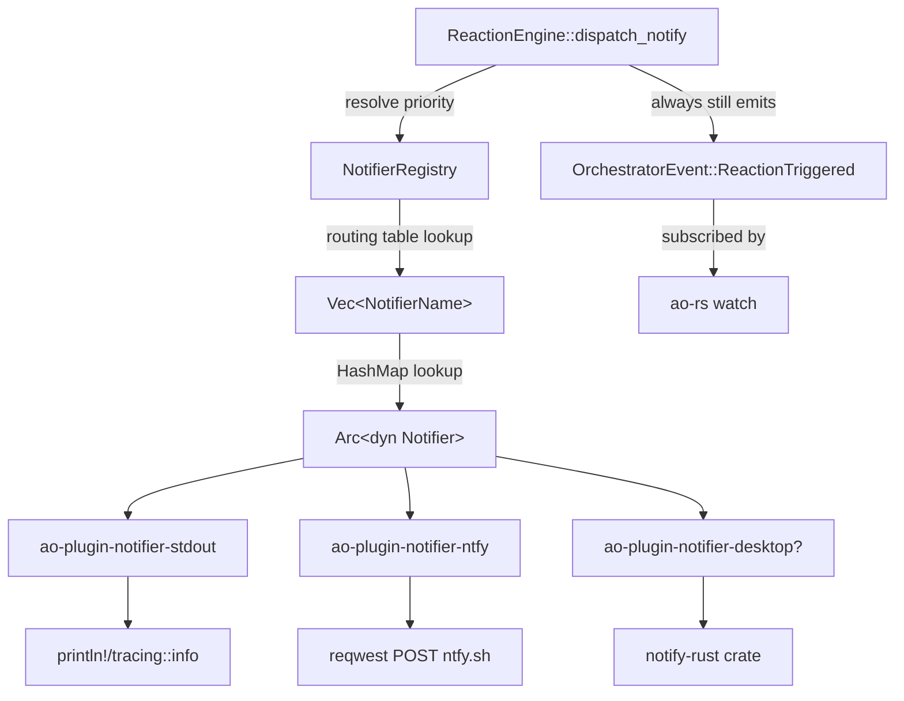

# Notifier routing — Slice 3 design

This design covers the full Slice 3 shape but the load-bearing
commitments are made for **Phase A** (types + registry + config,
no plugin crates, no engine integration). Phase B and later get
brief sections so reviewers see the whole arc.

## Architecture Overview



Key components:

| Component | Crate | Purpose |
|---|---|---|
| `Notifier` trait | `ao-core` | Plugin contract — single `send` method |
| `NotificationPayload` | `ao-core` | Data handed to every notifier `send` call |
| `NotifierError` | `ao-core` | Plugin error type, `thiserror`-derived |
| `NotifierRegistry` | `ao-core` | Name → `Arc<dyn Notifier>` + routing table |
| `NotificationRouting` | `ao-core` | Config-shape `HashMap<EventPriority, Vec<String>>` |
| stdout plugin | `ao-plugin-notifier-stdout` | Phase C, always-on default |
| ntfy plugin | `ao-plugin-notifier-ntfy` | Phase D, HTTP POST |
| (future) desktop/slack/email | … | Phases E+ |

## Data Models

### `NotificationPayload` (Phase A)

```rust
#[derive(Debug, Clone)]
pub struct NotificationPayload {
    /// Session the notification is about.
    pub session_id: SessionId,
    /// Reaction key that fired (e.g. "ci-failed").
    pub reaction_key: String,
    /// Action the engine actually took — always Notify at the call site
    /// but carried for plugins that want to log/format it.
    pub action: ReactionAction,
    /// Priority picked by the engine for this fire. Decides routing.
    pub priority: EventPriority,
    /// Title line. Engine synthesizes this from reaction_key + session.
    pub title: String,
    /// Body. `ReactionConfig.message` if set, otherwise an engine default.
    pub body: String,
    /// True if this notify is the escalation fallback after retries
    /// were exhausted. Plugins that want to badge "escalated" use this.
    pub escalated: bool,
}
```

### `NotifierError` (Phase A)

`thiserror`-derived to match `AoError`:

```rust
#[derive(Debug, thiserror::Error)]
pub enum NotifierError {
    #[error("notifier I/O failure: {0}")]
    Io(String),
    #[error("notifier configuration error: {0}")]
    Config(String),
    #[error("notifier external service error: {status}: {message}")]
    Service { status: u16, message: String },
    #[error("notifier timed out after {elapsed_ms}ms")]
    Timeout { elapsed_ms: u64 },
    #[error("notifier unavailable: {0}")]
    Unavailable(String),
}
```

Plugins are expected to wrap their own errors into these variants. The
engine treats all of them identically (log + record in outcome).

### `NotificationRouting` (Phase A)

```rust
#[derive(Debug, Clone, Default, PartialEq, Eq, Serialize, Deserialize)]
#[serde(transparent)]
pub struct NotificationRouting(HashMap<EventPriority, Vec<String>>);

impl NotificationRouting {
    pub fn names_for(&self, priority: EventPriority) -> Option<&[String]> {
        self.0.get(&priority).map(Vec::as_slice)
    }

    pub fn is_empty(&self) -> bool {
        self.0.is_empty()
    }

    #[cfg(test)]
    pub fn from_map(map: HashMap<EventPriority, Vec<String>>) -> Self {
        Self(map)
    }
}
```

Config shape:

```yaml
notification-routing:
  urgent: [stdout, ntfy]
  action: [stdout, ntfy]
  warning: [stdout]
  info: [stdout]
```

Tuple-struct newtype + `#[serde(transparent)]` gives the on-disk form
the clean map shape above — no wrapper key. Hiding the inner
`HashMap` behind `names_for` keeps the public API stable if we later
want to add per-reaction-key overrides or change the underlying
container. Kebab-case section header `notification-routing:` for
consistency with `reactions:` entries.

Default: an empty map — "no notifier configured for any priority".
Default-routing-to-stdout is enforced at the `ao-cli` registry
construction site (Phase C), not inside `NotificationRouting` itself,
so the config type stays pure and the fallback policy lives next to
the plugin wiring it depends on.

### `NotifierRegistry` (Phase A)

```rust
pub struct NotifierRegistry {
    plugins: HashMap<String, Arc<dyn Notifier>>,
    routing: NotificationRouting,
    /// One-shot warn dedup, same pattern as warn_once_parse_failure in
    /// the reaction engine. Keyed by "<priority>.<notifier_name>" or
    /// "priority.<priority>" for whole-priority misses.
    warned: Mutex<HashSet<String>>,
}

impl NotifierRegistry {
    pub fn new(routing: NotificationRouting) -> Self { ... }
    pub fn register(&mut self, name: impl Into<String>, plugin: Arc<dyn Notifier>) { ... }
    /// Resolve the priority against the routing table, returning the
    /// (name, plugin) pairs the engine should call. Pure lookup — no
    /// side effects here. Warn-once is triggered by `resolve` when a
    /// name is missing or a priority has no entries, via the dedup map.
    pub fn resolve(&self, priority: EventPriority) -> Vec<(String, Arc<dyn Notifier>)> { ... }
}
```

Ownership: one `NotifierRegistry` instance, constructed in `ao-cli`
after plugin instantiation, moved into `ReactionEngine` via a new
builder method `with_notifier_registry`. The engine stores it as
`Option<NotifierRegistry>` so existing call sites that don't attach
one keep working — identical pattern to `with_scm`.

## API Design

### `Notifier` trait (Phase A)

```rust
#[async_trait::async_trait]
pub trait Notifier: Send + Sync {
    /// Human-readable name used in the routing table
    /// (`"stdout"`, `"ntfy"`, `"desktop"`, …).
    fn name(&self) -> &str;

    /// Deliver a single notification. Returning `Err` does NOT crash
    /// the engine — the engine logs and records the outcome as
    /// `success = false`. Plugins should never panic.
    async fn send(&self, payload: &NotificationPayload) -> Result<(), NotifierError>;
}
```

One method, one associated function, matches the "plugin-author
writes one file" goal from the requirements doc.

### Engine call site (Phase B)

`ReactionEngine::dispatch_notify` grows from "emit event + return
success" to:

```rust
async fn dispatch_notify(
    &self,
    session: &Session,
    reaction_key: &str,
    cfg: &ReactionConfig,
) -> ReactionOutcome {
    let priority = resolve_priority(reaction_key, cfg);
    let payload = build_payload(session, reaction_key, cfg, priority);

    self.emit(OrchestratorEvent::ReactionTriggered { ... });  // unchanged

    let Some(registry) = &self.notifier_registry else {
        return ReactionOutcome { success: true, .. };  // Phase D behaviour
    };

    let targets = registry.resolve(priority);
    if targets.is_empty() {
        return ReactionOutcome { success: true, .. };  // no plugin wired, OK
    }

    let mut failed = Vec::new();
    for (name, plugin) in targets {
        if let Err(e) = plugin.send(&payload).await {
            tracing::warn!(
                notifier = %name, reaction = %reaction_key, error = %e,
                "notifier send failed"
            );
            failed.push(format!("{name}: {e}"));
        }
    }

    ReactionOutcome {
        success: failed.is_empty(),
        action: ReactionAction::Notify,
        message: if failed.is_empty() { cfg.message.clone() }
                 else { Some(format!("notifier failures: {}", failed.join("; "))) },
        escalated: false,
        ..
    }
}
```

`resolve_priority(reaction_key, cfg)` is the same priority-resolution
logic the engine already uses when it needs a default — pulled into a
small helper so the notify path and escalation path agree.

## Component Breakdown

### Phase A (this PR)

New module `crates/ao-core/src/notifier.rs`:

- `Notifier` trait
- `NotificationPayload`
- `NotifierError`
- `NotificationRouting`
- `NotifierRegistry`

Tests in the same file:

- `NotificationRouting` serde round-trip (YAML in/out).
- `NotificationRouting::default()` is empty.
- `NotifierRegistry::resolve` returns empty for empty routing.
- `NotifierRegistry::resolve` returns only matching names.
- `NotifierRegistry::resolve` warn-once dedup works (two missing
  lookups → one warn).
- Test-only mock `Notifier` impl records received payloads (used in
  Phase B integration tests; lives in `#[cfg(test)]` submodule).

`crates/ao-core/src/config.rs`: extend `AoConfig` with a
`notification_routing: NotificationRouting` field, read from the
`notification-routing:` section. Missing section → default (empty).

`crates/ao-core/src/lib.rs`: `pub mod notifier;` + re-exports.

No changes to `reaction_engine.rs`, `lifecycle.rs`, or any plugin crate
in Phase A.

### Phase B (next PR)

- `ReactionEngine::with_notifier_registry(registry)` builder.
- `ReactionEngine::dispatch_notify` wired through the registry (see
  API design above).
- Two or three new tests covering: no-registry path unchanged, empty
  routing path unchanged, single-plugin path emits payload, two-plugin
  path attempts both, plugin error records `success = false`.

### Phase C

- New crate `ao-plugin-notifier-stdout` with one file `src/lib.rs`:
  `StdoutNotifier` struct, `impl Notifier` that formats payload as
  one line and `println!`s it (or `tracing::info!`s — decide in
  Phase C). Wire into `ao-cli` so the default registry always has
  stdout registered even if the user doesn't put it in the routing
  table.

### Phase D

- New crate `ao-plugin-notifier-ntfy` with `reqwest` HTTP POST.
  Construction takes a `topic: String` (required). Base URL defaults
  to `https://ntfy.sh` but is overridable for testing against a local
  ntfy server. Map `EventPriority` to ntfy priority headers
  (1..=5).

### Phases E+

Desktop / slack / email / discord — one crate each, added as needed.
Each phase adds one plugin crate; scope may be revised when we get
there.

## Design Decisions

### Why `NotificationPayload` instead of reusing `OrchestratorEvent`?

Events on the broadcast bus are `Clone`, `Debug`, and `Send`, and must
stay narrow to avoid churn in every subscriber. Notifier payloads
want richer context (title, body, escalated flag, priority) that
doesn't belong on the event bus. Separating the two types keeps the
event surface small and lets the notifier payload evolve
independently.

### Why `Option<NotifierRegistry>` in the engine, not `Arc<dyn Router>`?

`NotifierRegistry` is a concrete type — there's no generic "router"
abstraction planned. Wrapping it in an `Option` matches the existing
`Option<Arc<dyn Scm>>` / `Option<ReactionEngine>` pattern elsewhere in
`LifecycleManager`. Future notifier types plug in via the `Notifier`
trait, not via a different registry type.

### Why priority-based routing, not per-reaction-key routing?

The TS reference uses priority-based and it matches common notifier
use cases: "page me on urgent, email me on action, quiet
notifications in a chat room for info". A per-reaction-key routing
table would be more expressive but doubles the config surface. If a
future user needs per-key routing, we can add a
`reaction-routing-override:` sibling section in a later phase.

### Why warn-once for missing plugins instead of failing parse?

Parse-time failure would mean a config that mentions a not-yet-wired
plugin name breaks the whole lifecycle. Warn-once at dispatch time
lets the user roll out plugins incrementally and iterate on the
routing table without cargo-building a new binary first. Matches the
lazy-parse pattern of `parse_duration` in Phase H.

### Why `async_trait` instead of `impl Future`?

Every other plugin trait in ao-core uses `async_trait` (`Scm`,
`Tracker`, `Runtime`, `Agent`, `Workspace`). Consistency over
marginal perf — this is a learning port.

### Why not propagate `NotifierError` up to the lifecycle loop?

A flaky notifier (e.g. ntfy.sh rate-limited, slack token rotated) must
not wedge the polling tick. The engine logs and records failure in
`ReactionOutcome`; the lifecycle treats it the same as any other
non-escalation failure. Matches the "never poison the engine"
principle used for malformed durations in Phase H.

## Non-Functional Requirements

- **Performance.** Notifier dispatch is in the hot path of
  `poll_one`. Each `send` runs inline (not spawned off) because the
  engine needs the outcome for `ReactionOutcome`. Plugins MUST have
  bounded timeouts — HTTP plugins default to 5s. This is documented
  in the `Notifier` trait doc comment and enforced by convention,
  not by the trait signature.
- **Memory.** `NotifierRegistry` is `O(plugins)` — a handful of
  `Arc`s. Routing table is `O(priorities * names)` = `O(4 * N)`. The
  warn-dedup set is bounded by `O(priorities + names)` ≈ same order.
- **Security.** Plugins with credentials (slack, email) will be
  instantiated in `ao-cli` from env vars / config file; the trait
  itself never sees a secret. Log messages must not log the payload
  body verbatim for priorities where secrets might flow (a session
  error message may contain tokens). Decision: we log `session_id`
  and `reaction_key` + truncated body at debug level, full body at
  trace only. Plugins handle their own logging.
- **Testability.** A `TestNotifier` mock records received payloads in
  an `Arc<Mutex<Vec<NotificationPayload>>>`. Lives in `#[cfg(test)]`
  inside `notifier.rs` so Phase B integration tests can import it.
